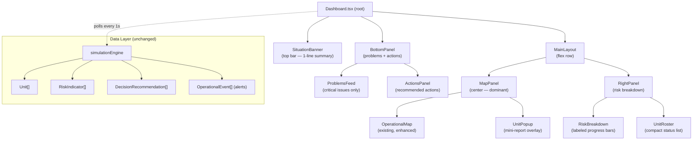
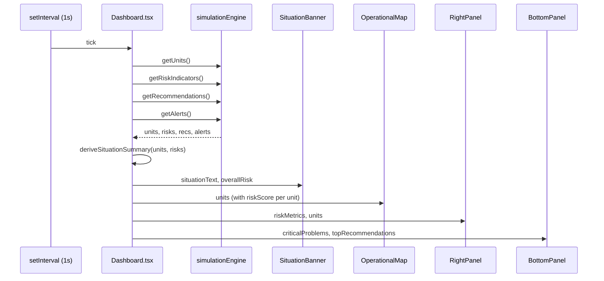
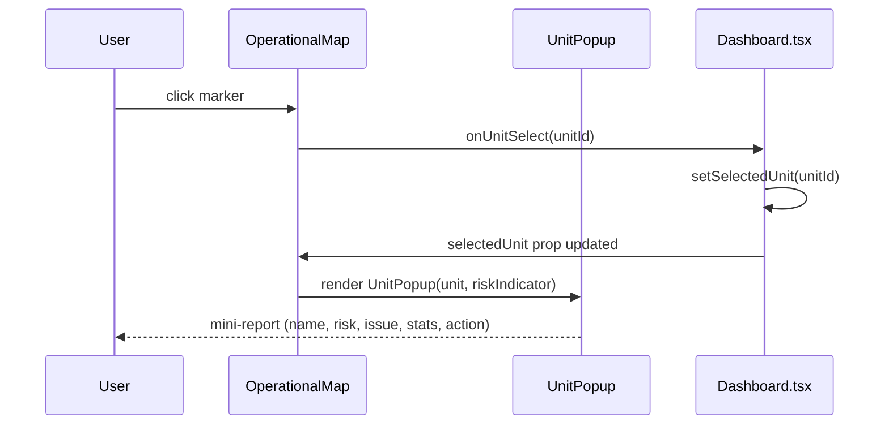

# Design Document: Dashboard Redesign

## Overview

The current operational dashboard prioritizes visual complexity (radar charts, abstract metrics, neon effects) over situational clarity. This redesign shifts the paradigm from "show data" to "tell the situation" — every element on screen must answer one of four questions: **What is happening? Where? How bad? What to do?**

The redesign retains the existing React 18 + TypeScript + TailwindCSS 3 stack and reuses the `simulationEngine` data layer without modification. Only the presentation layer changes: `Dashboard.tsx`, `OperationalMap.tsx`, and a set of new focused sub-components replace the current layout.

The visual language moves to a restrained dark theme — two accent colors (red for danger, amber for warning), consistent semantic color logic, reduced glow, and generous spacing — so operators can read the screen under stress without cognitive overload.

## Architecture

The redesigned dashboard follows a strict top-to-bottom information hierarchy that mirrors how a human brain processes urgency: global summary first, spatial context second, detail on demand.



## Sequence Diagrams

### Dashboard Data Flow (per tick)



### Unit Selection Flow



## Components and Interfaces

### Component 1: SituationBanner

**Purpose**: Single-line situational summary pinned to the top. Replaces the current header's abstract "Command Terminal V4.0.2" label with actionable intelligence.

**Interface**:
```typescript
interface SituationBannerProps {
  summary: string           // e.g. "⚠️ High Risk in Sector Bravo — 3 Units Critical"
  overallRisk: number       // 0–100, drives banner background color
  criticalCount: number     // number of critical-status units
  timestamp: Date
}
```

**Responsibilities**:
- Derive banner background from `overallRisk`: red (>70), amber (40–70), neutral (<40)
- Display timestamp (system clock) on the right
- Pulse/highlight when `criticalCount > 0`
- No interactive elements — read-only status strip

---

### Component 2: MapPanel

**Purpose**: Dominant center element. Wraps `OperationalMap` with enhanced marker rendering and zone overlays.

**Interface**:
```typescript
interface MapPanelProps {
  units: Unit[]
  riskIndicators: RiskIndicator[]
  sectors: Cluster[]
  selectedUnit: string | null
  onUnitSelect: (unitId: string) => void
}
```

**Responsibilities**:
- Pass enriched unit data (with `riskScore` merged in) to `OperationalMap`
- Render sector zone polygons with fill opacity proportional to average sector risk
- Trigger `UnitPopup` when a unit is selected
- Layer controls: Units toggle, Zones toggle (replaces current Heatmap/Threats/Units)

---

### Component 3: UnitPopup (replaces raw Leaflet popup HTML)

**Purpose**: Mini-report card shown when a map marker is clicked. Replaces the current raw data dump with a structured, human-readable report.

**Interface**:
```typescript
interface UnitPopupProps {
  unit: Unit
  riskIndicator: RiskIndicator
  recommendation: DecisionRecommendation | null
  onClose: () => void
}
```

**Responsibilities**:
- Show: unit name + risk badge, main issue summary (top risk factor), key stats (Health, Fuel, Ammo as mini bars), recommended action
- No raw coordinates, no type abbreviations
- Color-coded risk badge: red/amber/green

---

### Component 4: RiskBreakdown

**Purpose**: Right-side panel replacing the radar chart. Shows 5 fleet-wide metrics as labeled progress bars.

**Interface**:
```typescript
interface RiskBreakdownProps {
  metrics: RiskMetric[]
}

interface RiskMetric {
  label: string        // "Threat Level", "Unit Readiness", "Supplies", "Communication", "Visibility"
  value: number        // 0–100
  inverted?: boolean   // true = high value is bad (e.g. Threat Level)
}
```

**Responsibilities**:
- Render each metric as a labeled bar with percentage
- Bar color derived from value + `inverted` flag: red/amber/green
- No chart library dependency — pure CSS/Tailwind bars
- Static layout, no animations beyond smooth width transitions

---

### Component 5: UnitRoster

**Purpose**: Compact scrollable list of all units below `RiskBreakdown`. Replaces the current "Personnel Status" panel.

**Interface**:
```typescript
interface UnitRosterProps {
  units: Unit[]
  selectedUnit: string | null
  onUnitSelect: (unitId: string) => void
}
```

**Responsibilities**:
- One row per unit: name, status dot (color-coded), health + fuel mini-bars
- Highlight selected unit
- Click to select (syncs with map)
- Show only the 3 most critical units at the top (sorted by status: critical → warning → active)

---

### Component 6: ProblemsFeed

**Purpose**: Bottom-left panel. Shows only what is actively wrong right now — no historical log, no info-level events.

**Interface**:
```typescript
interface ProblemsFeedProps {
  problems: ActiveProblem[]
}

interface ActiveProblem {
  unitId: string
  unitName: string
  severity: "critical" | "warning"
  summary: string    // plain English: "Low health, immediate evacuation needed"
}
```

**Responsibilities**:
- Filter to `severity === "critical"` first, then `"warning"`
- Max 5 items visible (scroll for more)
- Each item: colored severity dot + unit name + plain-English summary
- No timestamps, no event IDs, no type codes

---

### Component 7: ActionsPanel

**Purpose**: Bottom-right panel. Shows the top recommended actions derived from `simulationEngine.getRecommendations()`.

**Interface**:
```typescript
interface ActionsPanelProps {
  recommendations: DecisionRecommendation[]
  onActionAcknowledge?: (recId: string) => void
}
```

**Responsibilities**:
- Show top 4 recommendations, sorted by priority (critical first)
- Each item: action verb + target + brief rationale (e.g. "Deploy backup to Sector Bravo — Bravo Squadron under high threat")
- Optional acknowledge button (dismisses from list for current session)
- No confidence percentages shown to user — internal only

---

## Data Models

### DerivedSituationSummary

Computed in `Dashboard.tsx` from raw simulation data. Drives `SituationBanner` and `ProblemsFeed`.

```typescript
interface DerivedSituationSummary {
  bannerText: string           // Human-readable 1-line summary
  overallRisk: number          // 0–100 weighted average
  criticalUnits: Unit[]        // units with status === "critical"
  warningUnits: Unit[]         // units with status === "warning"
  topProblems: ActiveProblem[] // derived from criticalUnits + riskIndicators
  dominantSector: string | null // sector name with highest avg risk
}
```

**Derivation Rules**:
- `bannerText`: `"{icon} {riskLabel} — {N} Units Critical • {weakCommsCount} Comms Weak • {topRecommendationType}"`
- `overallRisk`: `simulationEngine.getOverallRiskScore()`
- `topProblems`: for each critical/warning unit, pick the top `riskIndicator.factors[0]` as the summary

---

### EnrichedUnit (map rendering model)

```typescript
interface EnrichedUnit extends Unit {
  riskScore: number       // from RiskIndicator
  riskColor: "red" | "amber" | "green"  // derived from riskScore
  topFactor: string       // riskIndicator.factors[0] or ""
}
```

**Color derivation**:
- `riskScore > 70` → `"red"`
- `riskScore > 40` → `"amber"`
- else → `"green"`

---

### RiskMetric (for RiskBreakdown)

```typescript
interface RiskMetric {
  label: string
  value: number
  inverted: boolean
}
```

**Fleet-wide metric derivation** (computed in `Dashboard.tsx`):

| Label | Source | Inverted |
|---|---|---|
| Threat Level | avg `riskScore` across all units | true |
| Unit Readiness | avg `health` across all units | false |
| Supplies | avg `(ammo + fuel) / 2` across all units | false |
| Communication | % units with `communicationLink === "strong"` × 100 | false |
| Visibility | avg `environmentalData.visibility` | false |

---

## Error Handling

### Scenario 1: No units loaded yet (simulation cold start)

**Condition**: `units.length === 0` on first render  
**Response**: `SituationBanner` shows "Establishing uplink…" in neutral color; map renders empty; panels show skeleton placeholders  
**Recovery**: Automatic — next simulation tick (≤2s) populates data

### Scenario 2: All units critical simultaneously

**Condition**: `criticalUnits.length === units.length`  
**Response**: Banner turns solid red, `ProblemsFeed` shows all units, `ActionsPanel` shows top 4 by priority  
**Recovery**: No special handling needed — normal data flow handles it

### Scenario 3: `riskIndicators` array empty

**Condition**: `simulationEngine.getRiskIndicators()` returns `[]`  
**Response**: `RiskBreakdown` bars render at 0%; `EnrichedUnit.riskScore` defaults to 0; markers render green  
**Recovery**: Automatic on next tick

### Scenario 4: Selected unit no longer in units array (unit removed mid-session)

**Condition**: `selectedUnit` ID not found in current `units[]`  
**Response**: `setSelectedUnit(null)` — popup closes gracefully  
**Recovery**: User can re-select any available unit

---

## Testing Strategy

### Unit Testing Approach

Test pure derivation functions in isolation using Vitest:
- `deriveSituationSummary(units, riskIndicators, recommendations)` → correct `bannerText`, `criticalUnits`, `topProblems`
- `deriveRiskMetrics(units, environmentalData)` → correct 5 `RiskMetric` values
- `enrichUnits(units, riskIndicators)` → correct `riskColor` and `topFactor` per unit
- `deriveActiveProblems(units, riskIndicators)` → sorted by severity, plain-English summaries

### Property-Based Testing Approach

**Property Test Library**: fast-check (already available via Vitest ecosystem)

Key properties to verify:
- For any `units[]`, `overallRisk` is always in `[0, 100]`
- For any unit with `status === "critical"`, it always appears in `topProblems`
- `riskColor` is always one of `"red" | "amber" | "green"` — never undefined
- `bannerText` is always a non-empty string regardless of input state
- `RiskMetric.value` is always clamped to `[0, 100]`

### Integration Testing Approach

- Render `<Dashboard />` with a mocked `simulationEngine` returning fixed data; assert `SituationBanner` text matches expected summary
- Simulate unit selection via map click; assert `UnitPopup` renders with correct unit name and recommendation
- Verify that removing the radar chart import does not break the build (`recharts` import removed from `Dashboard.tsx`)

---

## Performance Considerations

- The 1-second polling interval is retained from the existing implementation — no change needed
- `RiskBreakdown` and `ProblemsFeed` are pure components (no internal state); React will skip re-renders when props are referentially equal
- `OperationalMap` marker updates are already handled via Leaflet's imperative API (not React re-renders) — this is preserved
- `deriveSituationSummary` and `deriveRiskMetrics` are cheap O(n) passes over ≤7 units — no memoization required at this scale
- Removing `recharts` (RadarChart) eliminates a non-trivial bundle dependency

---

## Security Considerations

- All data is client-side simulation — no network requests to secure endpoints
- Map tile requests go to OpenStreetMap (existing behavior, unchanged)
- Geocoding search uses Nominatim (existing behavior, unchanged)
- No new external dependencies introduced by this redesign

---

## Dependencies

**Retained**:
- `leaflet` + `react-leaflet` — map rendering
- `framer-motion` — banner pulse animation, unit popup entrance
- `lucide-react` — icons (AlertCircle, Shield, Radio, etc.)
- `tailwindcss` — all layout and color styling
- `simulationEngine` — data layer (zero changes)

**Removed**:
- `recharts` (RadarChart, PolarGrid, PolarAngleAxis, ResponsiveContainer) — no longer used after radar chart removal

**New**:
- None — the redesign is achieved entirely through new component composition within the existing stack

---

## Correctness Properties

*A property is a characteristic or behavior that should hold true across all valid executions of a system — essentially, a formal statement about what the system should do. Properties serve as the bridge between human-readable specifications and machine-verifiable correctness guarantees.*

### Property 1: Banner text is always non-empty

For any combination of `units`, `riskIndicators`, and `recommendations` (including empty arrays), `deriveSituationSummary` SHALL return a `bannerText` that is a non-empty string.

**Validates: Requirements 3.1**

---

### Property 2: Overall risk is always in bounds

For any `units` array and `riskIndicators` array, `deriveSituationSummary` SHALL return an `overallRisk` value in the closed range `[0, 100]`.

**Validates: Requirements 3.2**

---

### Property 3: Critical units are always captured

For any `units` array, every unit whose `status` is `"critical"` SHALL appear in the `criticalUnits` array returned by `deriveSituationSummary`.

**Validates: Requirements 3.3**

---

### Property 4: Risk color is always a valid enum value

For any unit and any `riskScore` value in `[0, 100]`, `enrichUnits` SHALL assign `riskColor` as exactly one of `"red"`, `"amber"`, or `"green"` — never `undefined` or any other value.

**Validates: Requirements 4.1, 4.2, 4.3, 4.4**

---

### Property 5: Risk metrics are always exactly 5 and in bounds

For any `units` array and `environmentalData` array, `deriveRiskMetrics` SHALL return exactly 5 `RiskMetric` entries, each with a `value` clamped to `[0, 100]`.

**Validates: Requirements 5.1, 5.2**

---

### Property 6: Active problems cover all critical and warning units

For any `units` array, `deriveActiveProblems` SHALL return a problem entry for every unit whose `status` is `"critical"` or `"warning"`, and SHALL place all `"critical"` entries before all `"warning"` entries.

**Validates: Requirements 6.1, 6.2**

---

### Property 7: Unit roster sort order is stable by severity

For any `units` array passed to `UnitRoster`, the rendered list SHALL always place `"critical"` units before `"warning"` units, and `"warning"` units before `"active"` units.

**Validates: Requirements 7.2**

---

### Property 8: Actions panel never exceeds 4 items and critical items come first

For any `recommendations` array of any length, `ActionsPanel` SHALL render at most 4 items, and among those items all entries with `priority === "critical"` SHALL appear before entries with any lower priority.

**Validates: Requirements 8.1, 8.2**

---

### Property 9: Problems feed never exceeds 5 items and critical items come first

For any `problems` array of any length, `ProblemsFeed` SHALL render at most 5 items, and among those items all entries with `severity === "critical"` SHALL appear before entries with `severity === "warning"`.

**Validates: Requirements 9.1, 9.2**
